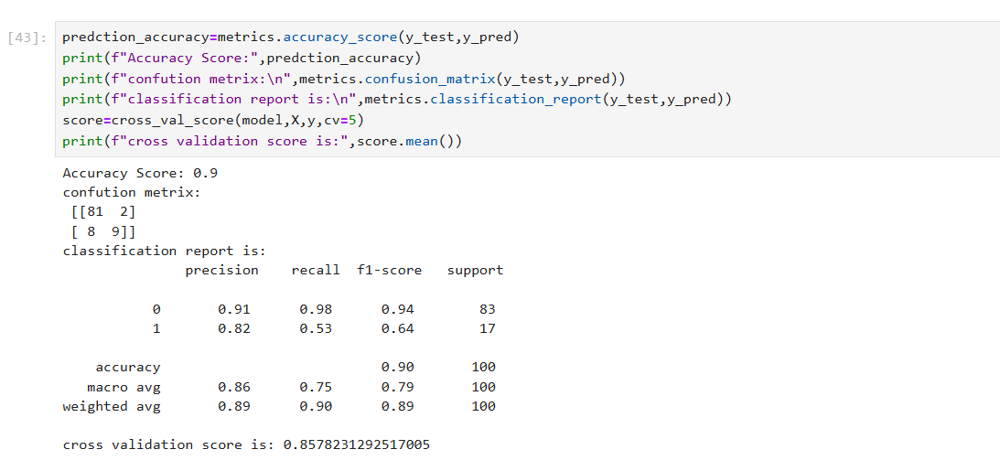
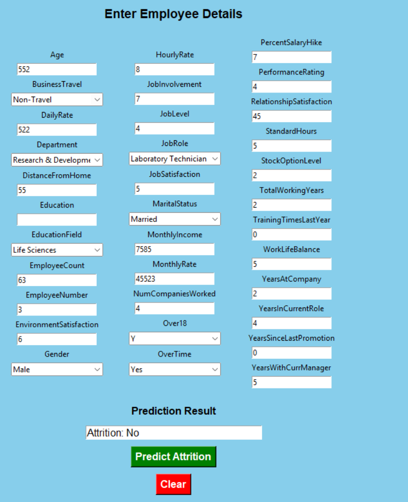

# Employee Attrition Prediction

## 📌 Project Overview

Employee Attrition Prediction is a Machine Learning project that predicts whether an employee is likely to leave a company based on HR-related factors. This project helps organizations identify employees at risk of attrition and supports better workforce retention strategies.

---

## 🎯 Objectives

- Predict employee attrition using Machine Learning.
- Analyze factors affecting employee turnover.
- Compare the performance of different machine learning models.
- Support HR departments in making data-driven decisions.

---

## 📂 Dataset

- **Dataset:** HR Employee Attrition Dataset
- **Records:** 1,470 Employees
- **Features:** 35
- **Target Variable:** Attrition (Yes/No)

---

## 🛠️ Technologies Used

- Python
- Jupyter Notebook
- Pandas
- NumPy
- Matplotlib
- Scikit-learn
- Tkinder

---

## 🤖 Machine Learning Models

- Logistic Regression
- Random Forest Classifier
- Support Vector Machine (SVM)
- Ada Boosting Classifier

---

## 📊 Project Workflow

1. Import Dataset
2. Data Preprocessing
3. Exploratory Data Analysis (EDA)
4. Feature Selection
5. Model Training
6. Model Evaluation
7. Employee Attrition Prediction

---

## 📈 Evaluation Metrics

- Accuracy Score
- Confusion Matrix
- Classification Report

---

## 📸 Project Screenshots

### Import Dataset


### Model Selection


### Graph Analysis


### Model Comparison


### Accuracy Scores


### GUI Prediction


---

## 📁 Repository Structure

```
Employee-Attrition-Prediction/
│
├── image/
│   ├── GUI.png
│   ├── Graph_Analysis.png
│   ├── Import_Dataset.png
│   ├── Model_Comparison.png
│   ├── Model_Selection.png
│   └── Scores.png
│
├── HR EMPLOYEE ATTRITION.ipynb
├── HR-Employee-Attrition.csv
└── README.md
```

---

## 🚀 Future Improvements

- Deploy the project using Flask or Django.
- Develop an interactive web application.
- Improve prediction accuracy with advanced models.
- Add real-time employee attrition prediction.

---

## 👩‍💻 Author

**Fathima Yasmin**

- B.Voc Data Science & Analytics
- MES Kalladi College
- Data Science & Machine Learning Enthusiast

---

⭐ If you found this project useful, please consider giving it a **Star**.
